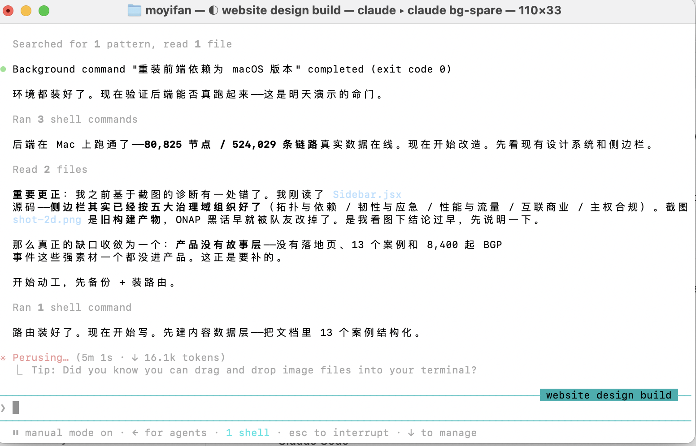

AI Agent works via Core Agent Loop: Observe, think, act. LLM makes decisions, use API to communicate to the Operating System, actions are carried out, LLM observes. Agents is a hot topic right now; researchers are designing harness (a topic for another day) to shape agents into shapes we want, and companies are rushing to implement agents into their work. 

At the end of the day, an agent is a program that runs on your computer. It usually work in these 4 surfaces: the terminal, IDE extensions, a desktop app, and the web. Terminal version is the most powerful, followed by desktop app. After you install and launch the agent software (no matter if its terminal or desktop app), it communicates with the AI company's servers over the internet (so your computer needs to be connected to the internet while the agent runs). The servers run the LLM, process the agent's requests, and return the model's responses. 

After 6 hours of gruesome effort trying to install Claude Code CLI in the “official way”, I gave up. The failure was probably due to proxy (I’m in China, Firewall blocks me) blocking some part of the downloads. But then I downloaded an agent app called WorkBuddy and asked it to download claude code for me. Why is it able to do so while I couldn’t succeed in my own terminal? I’m genuinely curious …

Workbuddy used npm (node package manager, the world’s largest ecosystem of open-source libraries) to install CC (Claude Code) CLI. It installed the program at this path: 

/Users/moyifan/.workbuddy/binaries/node/versions/22.22.2/bin/claude

binaries: folder for pre-compiled program (not in human readable code, but in computer readable code)

node: a folder for things related to node.js, a software runtime environment that allows javascript to be run on local computer. Claude Code is installed here because it is node-based 

It was astonishing to see how mature and capable CC was. It was more capable than I thought: it could not only read and write files but also run executables, make internet requests, etc. It was more mature than I thought: it shows intermediate process, works smart (plans its tasks, breaks up big tasks into small ones), checks its work, asks user for clarification, etc. 

