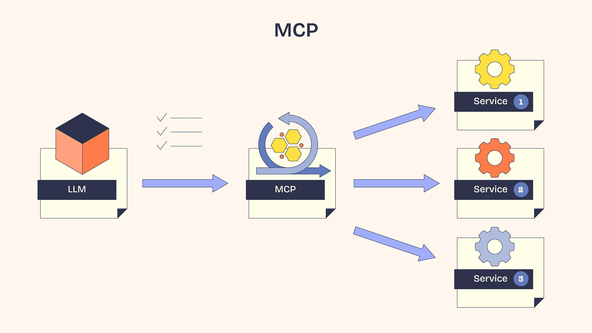

An **API** (Application Programming Interface) is a set of defined rules and protocols that allows two different software applications to communicate and exchange data with each other. 

Clients send request via the internet to web servers, and the request usually includes an **API Key** (a digital identity card) to prove the client has permission to access the data. 

HTTPS sets up secure connection between two computers, e.g. your phone sends an HTTPS request to the weather app's  server, but the server needs to recognize the message and do the things as requested. This rulebook that translates the request to actions is **API documentation**. In this context, the entire action of request is called **API call**. 

The main take-away is that **API lets softwares to talk to each other**. This is especially important to the modern internet services because it lets developers connect existing blocks of technology together without having to know the specifics of each component. For example, an app may use Google Maps API, Venmo API, and ChatGPT API. 

The creation of API dates way back, but the way AI uses it is modern and a bit more complex. People developed a framework (standard) called **MCP (Model Context Protocol)** that wraps around API for the purpose of **letting AI models discover and use tools/data exposed by software in a standardized way**. MCP is an additional layer between AI model and software services. For example, an AI agent decides to create a new branch in your github repo, it tells the MCP server which github tools to call, and MCP server makes standard API call to github servers. Calls to other services would look similar in format at the MCP call step. This way, the agent does not need to know the specific formats for API calls for individual services; developers enjoy more standardization and interoperability when building agents. 

